# ⚡ Kiuren Canete (Jay)

  
  
  
  

---

### 💻 Live Agent Runtime

  

---

### 🛠️ Core Tech Stack & Capabilities

| Domain | Technologies & Systems |
|---|---|
| **AI & Agent Systems** | `Multi-Agent Swarms` `Autonomous Runtimes` `Model Context Protocol (MCP)` `Browser Automation` |
| **Languages** | `TypeScript` `Python` `JavaScript` `Dart` `PHP` `Bash / Shell` |
| **Frameworks** | `React` `Node.js` `Vite` `Flutter` `Laravel` `Tailwind CSS` |
| **Infrastructure & Tools** | `Linux` `Git` `Docker` `Cloudflare Pages` `PostgreSQL` `SQLite` |

---

### 📊 GitHub Activity & Metrics

  
  

---

  Engineered by <strong>Kiuren Canete (Jay)</strong> • Architecting autonomous systems at Spawntel

